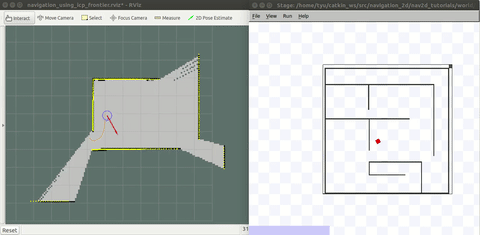

Nearest frontier planner
===
__Implement an automatic exploration algorithm for robot.__



This package should be used with `move_base`, a robot (real robot, `stage` or `gazebo`) and a mapping 
algorithm(like: [gmapping](https://github.com/ros-perception/slam_gmapping),[cartographer](https://github.com/googlecartographer/cartographer) or [icp](https://github.com/tyuownu/mrpt_slam)).

## Usage
``` bash
roslaunch navigation_stage move_base_icpslam_5cm.launch
roslaunch nearest_frontier_planner tutorial3_icp_nfp.launch
rosservice call /StartExploration
```
